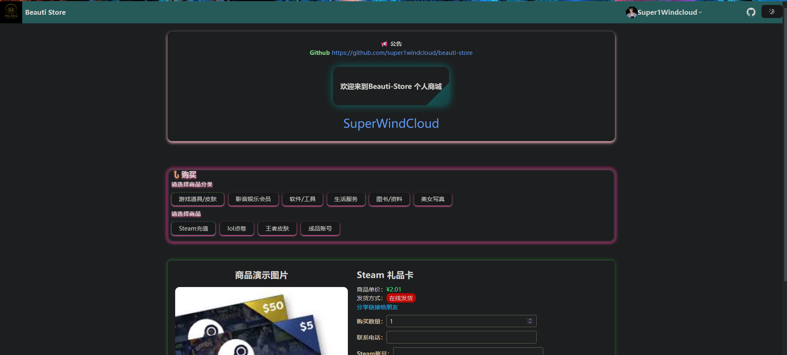

# beautiful-store

## 介绍
基于Vue3+Spring-boot3的在线发卡店铺

## 技术栈
- 前端 : vue3 + vite+ shadcn-vue+tailwindcss+vue-router+pinia 
- 后端 : Spring-boot3 + Spring-data-jpa + Spring-security + Jwt  + Redis + PostgreSQL + Lombok +  + Docker
+ Spring-Mail + Spring-Oauth2

## 示例





##  Docker-Compose部署
```
docker-compose up --build 
```

##  源码构建
```bash
mvn clean install -DskipTests
mvn -pl backend -am spring-boot:run
``` 

